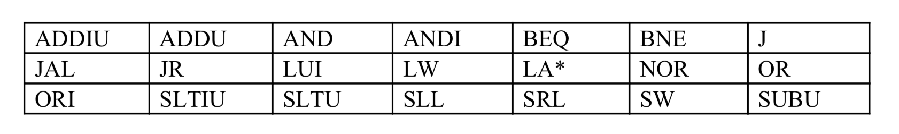
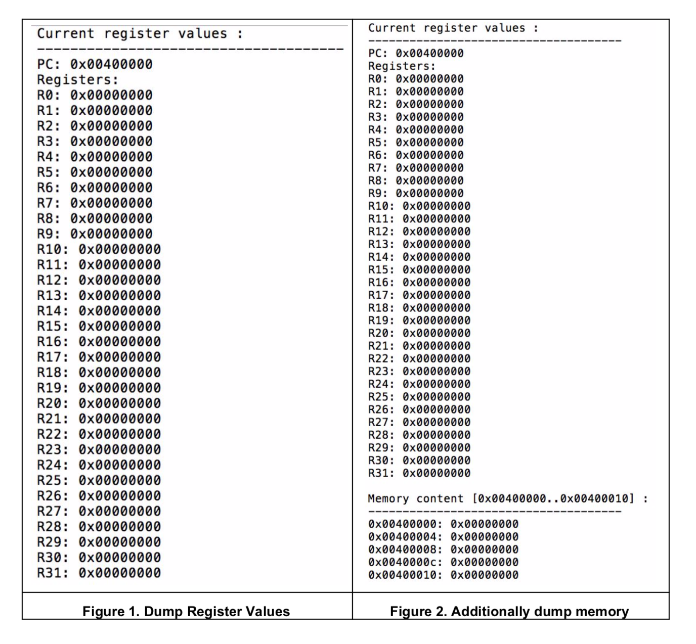

# MIPS ISA Simulator


## Introduction

### 1. Overview

This project is a simulator of a subset of the MIPS instruction set. The simulator loads a MIPS binary into a simulated memory and executes the instructions. Instruction execution will change the states of registers and memory.

### 2. Simulation Details

For a given input MIPS binary, the simulator will be able to mimic the behaviors of the MIPS ISA execution.

**2.1 States**

The simulator will maintain the system states, which consist of the necessary register set (R0-R31, PC) and the memory. The register and memory will be created when the simulation begins.

**2.2 Loading an input binary**

For a given input binary, the loader will identify the text and data section sizes. The text section will be loaded to the simulated memory from the address 0x400000. The data section will be loaded to the simulated memory from the address 0x10000000. In this project, the simple loader does not create the stack region.

**2.3 Initial states**

- PC: The initial value of PC is 0x400000.

- Registers: All values of register0 to 31 are set to zero.

- Memory: You may assume all initial values are zero, except for the loaded text and data

  sections.

**2.4 Instruction execution**

With the current PC, 4B from the memory is read. The simulator will parse the binary instruction and identify what the instruction is and what are the operands. Based on the MIPS ISA, the simulator will accurately mimic the execution, which will update either the PC, registers, or memory.

**2.5 Completion**

The simulator will stop after executing a given number of instructions.

**2.6 Supported instruction set**




The detailed information regarding instructions are in the attached [MIPS_Green_Sheet.pdf](MIPS_Green_Sheet.pdf) page.


## 3. Simulator Options and Output

**4.1 Options
** sce212sim [-m addr1:addr2] [-d] [-n num_instr] inputBinary

- -m : Dump the memory content from addr1 to addr2

- -d : Print the register file content for each instruction execution. Print memory content too if –m

  option is enabled.

- -n : Number of instructions simulated

  The default output is the PC and register file content after the completion of the given number of instructions. If –m option is specified, the memory content from addr1 to addr2 will be printed too.

  If –d option is set, the register (and memory dump, if –m is enabled) will be printed for every instruction execution.


The default output is the PC and register file content after the completion of the given number of instructions. If –m option is specified, the memory content from addr1 to addr2 will be printed too.

If –d option is set, the register (and memory dump, if –m is enabled) will be printed for every instruction execution.


**4.2 Formatting Output**

PC and register content will be printed in addition to the optional memory content. You should print the output with standard output.


1. If you type the command line as below, the output file should show only PC and register

   values like Figure 1.
    $ ./sce212sim –n 0 input.o

2. If you type the command line as below, the output file should show memory contents of specific memory region, PC and register values like Figure 2.

   $] ./sce212sim –m 0x400000:0x400010 –n 0 input.o





#### Test Codes are provided, you can use that to test the program.

* **Input**

```bash
$ make
$ make test
```

* **Output**

```bash
gcc -o sce212sim sce212sim.o util.o parse.o run.o
Testing example01
	Test seems correct

Testing example02
	Test seems correct

Testing example03
	Test seems correct

Testing example04
	Test seems correct

Testing example05
	Test seems correct

Testing fact
	Test seems correct

Testing leaf_example
	Test seems correct
```


